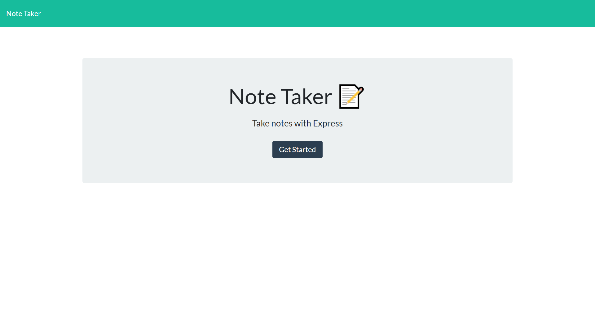
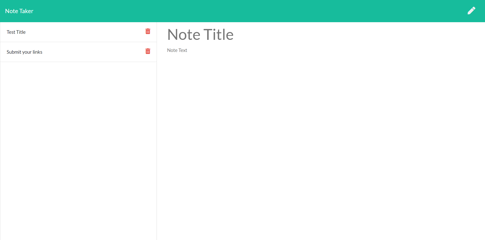

# Note-Taker

[](https://opensource.org/licenses/MIT)

## Table of contents

* [Title / Repository Name](#title)
* [Table of contents](#table-of-contents)
* [Description](#description)
* [Preview](#preview)
* [Links](#links)
* [Installation](#installation)
* [Contact](#contact)
* [Contributing](#contributing)
* [License](#license)


# Description
The Note-Taker is an application that allows the user to take notes and save them. The user can only save their notes after writing a title and putting down notes in the body section. Once saved the notes will appear to the side and can be accessed again whenever needed. The user can also delete any entries they want once they are done with any notes. 

# Preview



# Links
Github Repo: https://github.com/tjl2125/Note-Taker

Heroku Link: https://infinite-wave-01880.herokuapp.com/

# Installation 
Clone or fork the repo. 
Go to the root directory.
Open a new integrated terminal. 
Then npm install the dependencies. 
```
npm i
```
Please make sure you have already install Node.js. 

Development environment url for the server.js file: http://localhost:8080


# Contact
[Github profile](https://github.com/tjl2125)

[Email](tjl2125@alum.barnard.edu)

# Contributing 
Fork the repo.
Send a pull request or email me if any issues/improvements you find. 

# License
Copyright <2021> <Taylor Leong>

Permission is hereby granted, free of charge, to any person obtaining a copy of this software and associated documentation files (the "Software"), to deal in the Software without restriction, including without limitation the rights to use, copy, modify, merge, publish, distribute, sublicense, and/or sell copies of the Software, and to permit persons to whom the Software is furnished to do so, subject to the following conditions:

The above copyright notice and this permission notice shall be included in all copies or substantial portions of the Software.

THE SOFTWARE IS PROVIDED "AS IS", WITHOUT WARRANTY OF ANY KIND, EXPRESS OR IMPLIED, INCLUDING BUT NOT LIMITED TO THE WARRANTIES OF MERCHANTABILITY, FITNESS FOR A PARTICULAR PURPOSE AND NONINFRINGEMENT. IN NO EVENT SHALL THE AUTHORS OR COPYRIGHT HOLDERS BE LIABLE FOR ANY CLAIM, DAMAGES OR OTHER LIABILITY, WHETHER IN AN ACTION OF CONTRACT, TORT OR OTHERWISE, ARISING FROM, OUT OF OR IN CONNECTION WITH THE SOFTWARE OR THE USE OR OTHER DEALINGS IN THE SOFTWARE.
